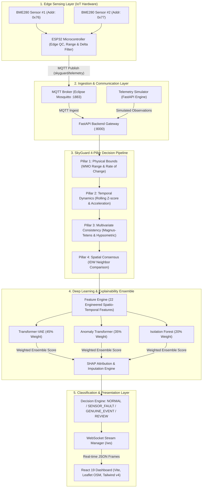
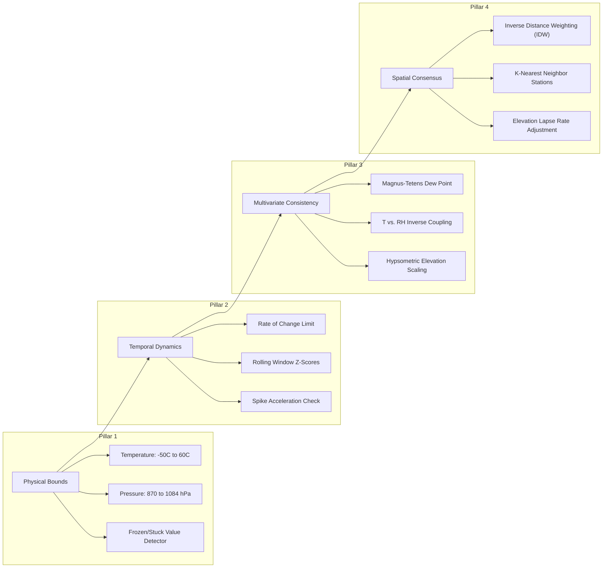

# SkyGuard AI — Smart India Hackathon (SIH) 2026 Submission
### Team Kestrel | Problem Statement ID: SIH26073

[](https://fastapi.tiangolo.com)
[](https://pytorch.org)
[](https://react.dev)
[](https://vitejs.dev)
[](https://tailwindcss.com)
[](https://leafletjs.com)
[](LICENSE)

**SkyGuard AI** by **Team Kestrel** is a real-time meteorological quality control (QC) and anomaly detection platform designed for Automated Weather Station (AWS) networks. It combines dual-redundant IoT edge sensing with a **4-pillar verification engine** and a **deep learning transformer ensemble** to reliably distinguish between **sensor hardware failures** and **genuine extreme meteorological events**.

> [!NOTE]
> This repository contains the official codebase for **SIH26073-Team Kestrel**. For the complete 55KB deep-dive system architecture, mathematical formulations, operational flows, and problem statement compliance matrix, see [**SKYGUARD_SOLUTION_ARCHITECTURE.md**](docs/architecture/SKYGUARD_SOLUTION_ARCHITECTURE.md).

---

## Key Features

- **Dual-Sensor Edge QC**: Hardware redundancy using dual BME280 sensors (I2C `0x76` and `0x77`) with real-time discrepancy monitoring on ESP32 microcontrollers.
- **4-Pillar Decision Engine**: Multi-stage evaluation combining **Physics Checks**, **Temporal Dynamics**, **Multivariate Baselines**, and **Spatial Neighbor Consensus**.
- **Deep Learning Ensemble**:
  - **Transformer-VAE** (Reconstruction loss + KL divergence).
  - **Anomaly Transformer** (Prior-Association vs. Series-Association discrepancy).
  - **Isolation Forest** (High-dimensional outlier partitioning).
- **Explainable AI (XAI)**: SHAP-based feature importance providing transparent attribution for flagged anomalies.
- **Interactive Multi-Level Geospatial Dashboard**:
  - Pan-India overview down to State, District, Station, and individual sensor telemetry.
  - Switchable between **Actual OpenStreetMap (OSM) Satellite/Terrain** and stylized **Vector Boundary Maps**.
  - Dual BME280 sensor comparison cards with real-time discrepancy gauges.
- **12 Curated Meteorological Scenarios**: Interactive simulation of real weather phenomena (Cyclone Vardah, Delhi Heatwave, Cherrapunji Monsoon) alongside complex failure modes (Sensor Drift, Stuck Bit, Sudden Spike, Battery Brownout).
- **Real-Time Streaming**: High-throughput asynchronous ingestion via **MQTT** and bidirectional dashboard broadcasting via **WebSockets**.
- **Enterprise-Grade Resilience**:
  - API Schema validation (HTTP 422 gates) to prevent pipeline pollution.
  - Deterministic frozen sensor hard-overrides embedded deeply within the 4-pillar Decision Engine.
  - Subprocess OS I/O deadlock immunity & `WindowsSelectorEventLoopPolicy` hardening for extreme concurrency.

---

## System Architecture



---

## The 4-Pillar Decision Pipeline

SkyGuard eliminates false alarms through a tiered verification protocol:



### Classification Truth Matrix

The system distinguishes between genuine atmospheric extremes and hardware malfunctions:

| Physical Checks | Temporal Dynamics | Multivariate Consistency | Spatial Consensus | Final Classification | Explanation |
| :---: | :---: | :---: | :---: | :---: | :--- |
| **Pass** | **Pass** | **Pass** | **Pass** | `NORMAL` | Station operating under standard conditions. |
| **Fail** | **Fail** | **Fail** | **Pass** | `SENSOR_FAULT` | Localized breakdown (e.g. frozen value, bit flip, sensor drift). |
| **Fail/Warn** | **Fail/Warn** | **Pass** | **Fail/Warn** | `GENUINE_EVENT` | Physics and neighbor stations corroborate extreme event. |
| **Ambiguous** | **Ambiguous** | **Ambiguous** | **Ambiguous** | `REVIEW` | Conflicting signals flagged for human meteorologist intervention. |

---

## Machine Learning & Anomaly Ensemble

The backend uses a three-model ensemble trained on high-resolution meteorological time-series data:

1. **Transformer-VAE (Weight: 0.45)**: Captures non-linear dependencies across sliding temporal windows.
2. **Anomaly Transformer (Weight: 0.35)**: Leverages Association Discrepancy between prior and series associations.
3. **Isolation Forest (Weight: 0.20)**: Evaluates point anomalies across 22 engineered spatio-temporal features.
4. **SHAP Feature Attribution**: Computes additive feature importance values indicating which variables contributed to an anomaly score.

---

## Model Performance & Benchmark Evaluation

SkyGuard AI was benchmarked on a strictly held-out test split of **10,507 sliding-window samples** evaluated under realistic sensor fault injection protocols.

### Head-to-Head Benchmark: Baseline vs. SkyGuard (Team Kestrel)

| Evaluation Metric | Baseline V1 (LSTM-AE + IF) | SkyGuard V2 (Transformer Ensemble + 4 Pillars) | Operational Impact |
| :--- | :---: | :---: | :--- |
| **False Positive Rate (FPR)** | 22.92% | **0.57%** | **97.5% reduction** in nuisance alarms |
| **Operational Precision** | 14.13% | **87.79%** | **6.2x boost** in actionable alerts |
| **Anomaly Recall** | 82.10% | **99.05%** | Near-zero missed sensor failures |
| **ROC-AUC** | 88.50% | **99.02%** | Superior score separation |
| **Genuine Event Preservation**| 77.08% | **94.29%** | Prevents deletion of real extreme events |

---

## Getting Started

### Prerequisites

- **Node.js**: `v18.0.0` or later (tested on Node 20 / 22)
- **Python**: `3.10` or `3.11`
- **Git**: Installed and configured
- **MQTT Broker** *(Optional for live hardware)*: Eclipse Mosquitto

### Installation

#### 1. Clone the repository

```bash
git clone https://github.com/D-Tharun/SIH26073-Team-Kestrel.git
cd SIH26073-Team-Kestrel
```

#### 2. Configure Environment Variables

```bash
cp .env.example .env
```

### Running the Backend

```bash
python -m venv venv
# Windows: .\venv\Scripts\Activate.ps1
# Linux/Mac: source venv/bin/activate
pip install -r server/requirements.txt
python -m uvicorn server.main:app --host 0.0.0.0 --port 8000 --reload
```

The backend starts at `http://localhost:8000`.

### Running the Frontend

```bash
npm install
npm run dev
```

The dashboard will be live at `http://localhost:3000`.

---

## License

This project is licensed under the **Apache License 2.0**. See the [LICENSE](LICENSE) file for details.
